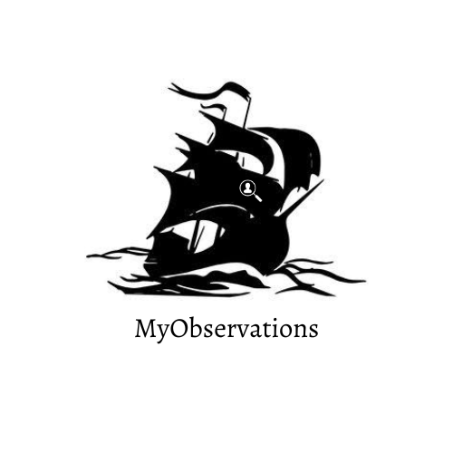

# MyObservations

  

MyObservations, foi criado com a intensão de facilitar a criação de links dorkings, deixando mais rápido o uso da técnica "Google Dorking"/"Google Hacking", fazendo links de forma rápida.

> **ANDROID** 

 > - - [ ] **KALI** 

 > - - [x] **TERMUX** 

# Instalação no Termux

 - `git clone github.com/Phant0mthegreat/MyObservations`

 - `cd MyObservations`

 - `python3 MyObservations.py`

# Utilização

Após sair da ferramenta, basta digitar

 - `cd MyObservations`

 - `python3 MyObservations.py`

Para iniciar o programa quando quiser
